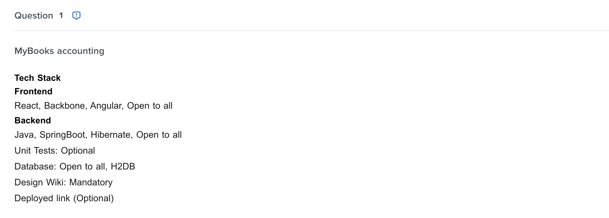
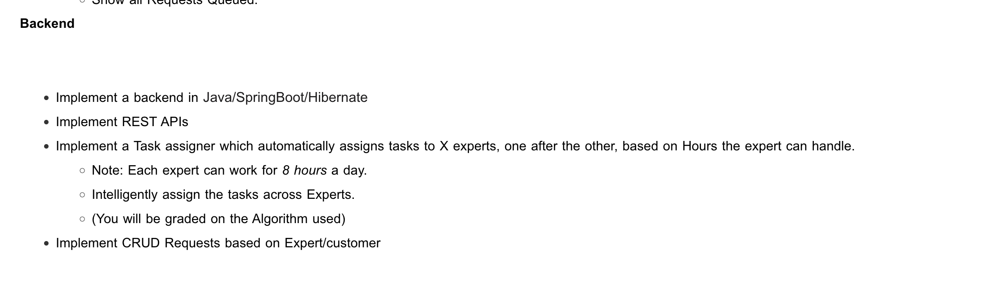

# MyBooks Accounting Web Application

This is a submission web application for [Intuit Coding Challenge Full Stack](https://assessment.hackerearth.com/challenges/new/hiring/intuit-fullstack-software-engineer-hiring-challenge/).

## Tools and Technologies used

The framework used for this application is NEXT JS which means:

- React for the Frontend
- Node for the Backend


## Installation and setup:

I am using node version 18 and would recommend testing with the same version. One can always switch node versions using node version manager with this command: `nvm use 18`. If the version is already not installed, use this command:

```bash
>> nvm install 18
>> nvm use 18
```

However make sure that `node version manager` is installed in your system. If not, [here](https://www.freecodecamp.org/news/node-version-manager-nvm-install-guide/) is the guide on how to do so.

Run the following commands one by one. (I have used yarn however you may use npm as well).

```bash
>> git clone https://github.com/sedhha/mybooks-accounting.git
>> cd mybooks-accounting
>> yarn
```

Now to spin up the dev server:

```bash
>> yarn dev
```
Now the server should be up and running on this [link](http://localhost:3000).

## Code Details

In this section, I am mentioning the details of different items involved. 
Folder structure:

```bash
- mybooks-accounting
  - interfaces // Contains all the typed definitions and interfaces
    - frontend
        - FormSelection.ts
        - index.ts // Contains all the exported items
        - NavBar.ts
    - components // Contains all the frontend components used in the project
        - Common // Contains all the common project components used at multiple places
        ...
    - pages
      - Home.js
      - About.js
      - Contact.js
    - utils
      - api.js
      - helpers.js
  - package.json
  - README.md

```


At very high level we have:

### Frontend

Frontend majorly consists of two components:

- [Login Screen](components/Login)


### Backend

### Unit Testing

### CI/CD


## Appendix


### Message for the Evaluators

As mentioned in the question here:



and then in the bottom section:



I got little confused if it is open to any backend technology or not. However, the question got me giving it a try so here I have created it with Node. I didn't use springboot as I have never coded in the same. I am familiar to Scala Play Framework though.

This was just to save the time and I am well aware of restful API, devops, CI/CD and backend concepts. I can pick up any framework pretty quickly (Java | SpringBoot) as the core concepts remain the same. :)

